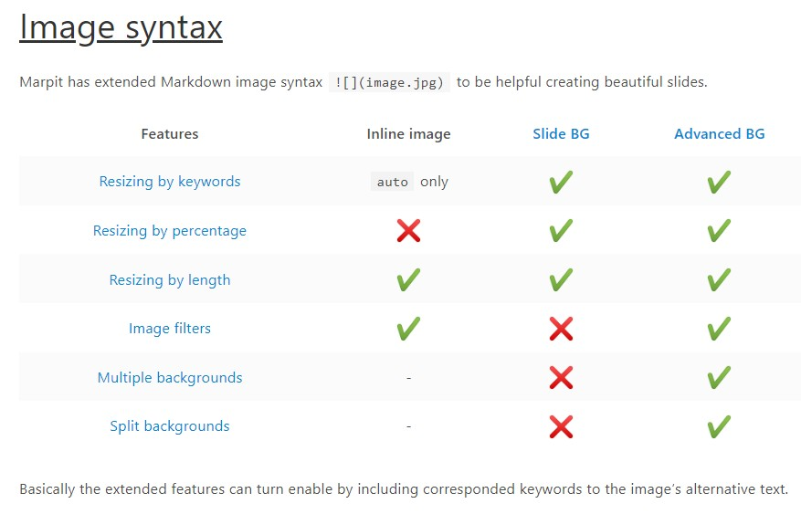

<!--将下面所有日文翻译成中文 --> 

<!-- _class: lead -->

# Marp学术主题

#### 参考: [marp-theme-academic](https://github.com/kaisugi/marp-theme-academic)

<br>

**作者**
YYYY/MM/DD

---

<!-- _header: 基本 -->

目前现有的GNN的推荐系统都是在中心化服务器上训练的, 并且用户项图(user-item)也是在中心服务器上存放, 这会面临着隐私泄漏的风险

FedGNN提出了采用联邦学习的方式, 去中心化的协同训练GNN模型

- 利用 **差分隐私(differential privacy, DP)** 的技术应用于用户客户端来计算局部梯度, 以保护用户隐私
- 为了保护用户交互的真实项, FedGNN采用 **伪交互项采样技术(pseudo interacted item sampling)** 
- 为了在不泄露用户隐私的情况下应用用户的高阶交互信息, FedGNN提出了一种 **保护隐私的用户项拓展方法(privacy-preserving user-item graph expansion method)**

---

<!-- _header: 公式-->

1. 将node $u_i$ 转换为嵌入表示 $e_{i}^{u}$
2. 将K个item nodes转换为对应的嵌入表示 $\left[\mathbf{e}_{i, 1}^t, \mathbf{e}_{i, 2}^t, \ldots, \mathbf{e}_{i, K}^t\right]$
3. 将N个neiboring user nodes转换为对应的嵌入表示 $\left[\mathbf{e}_{i, 1}^u, \mathbf{e}_{i, 2}^u, \ldots, \mathbf{e}_{i, N}^u\right]$
4. 由于模型还没有调整好, 用户嵌入可能会不准确, 模型首先忽略neighboring user embeddings, 直到模型调整好了再将他们加入训练
   1. $e_{i}^{u}$ 和 $\left[\mathbf{e}_{i, 1}^t, \mathbf{e}_{i, 2}^t, \ldots, \mathbf{e}_{i, K}^t\right]$ 是同步更新的, 而 $\left[\mathbf{e}_{i, 1}^u, \mathbf{e}_{i, 2}^u, \ldots, \mathbf{e}_{i, N}^u\right]$ 是周期性更新的
5. 将GNN应用在嵌入上, 输出是$h_{i}^{t}$, $\left[\mathbf{h}_{i, 1}^t, \mathbf{h}_{i, 2}^t, \ldots, \mathbf{h}_{i, K}^t\right]$ 和  $\left[\mathbf{h}_{i, 1}^u, \mathbf{h}_{i, 2}^u, \ldots, \mathbf{h}_{i, N}^u\right]$

---

<!-- _header: 公式 -->

$$ I_{xx}=\int\int_Ry^2f(x,y)\cdot{}dydx $$

$$
f(x) = \int_{-\infty}^\infty
    \hat f(\xi)\,e^{2 \pi i \xi x}
    \,d\xi
$$

---

<!-- _header: 代码 -->

这是一段python代码

```python
def grid2list(grid):
    list_in = [[]]
    for grid_temp in grid:
        list_out = []
        for val in grid_temp:
            for list_temp in list_in:
                list_out.append(list_temp + [val])
        list_in = list_out
    return list_in
```

---

<!-- _header: 图片 -->

更多marp的[image syntax](https://marpit.marp.app/image-syntax)

 <!-- Setting size to 32x32 px -->

---

<!-- _header: 表格 -->

Fruit | Colour | Amount | Cost
-----|------|:-----:|------:
Banana | Yellow | 4 | £1.00
Apple | Red | 2 | £0.60
Orange | Orange | 10 | £2.50
Coconut | Brown | 1 | £1.50

--- 

<!-- _header: 居中的表格 -->

我是什么东西

|  表头   | 表头  | 表头 |
|  ----  | ----  |--- |
| 单元格  | 单元格 |单元格|
| 单元格  | 单元格 |单元格|

--- 

<!-- _header: 注释 / 引用 -->

我是正文, 我是正文, 我是正文, 我是正文, 我是正文, 我是正文
我是正文
我是正文
我是正文

> 这是一段引用, 用来引用别人的话/定义/参考
> This is a blockquote with two paragraphs. Lorem ipsum dolor sit amet,