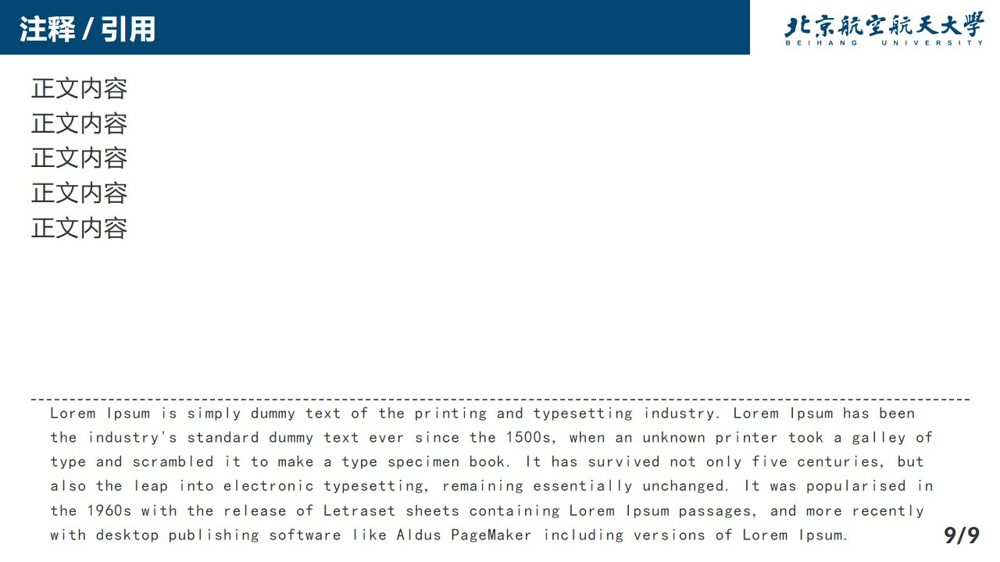

# BUAA-Marp-Theme


based on: https://github.com/kaisugi/marp-theme-academic

feature: 

- BUAA logo (red / blue)
- optimize font
- table adjust

## Usage

export to html: 

```shell
npx @marp-team/marp-cli@latest buaa.md -o buaa.html --theme-set ./theme --pdf-outlines --allow-local-files
```

export to pdf: 

```shell
npx @marp-team/marp-cli@latest buaa.md -o buaa.pdf --theme-set ./theme --pdf-outlines --allow-local-files
```

for more commands, see: https://github.com/marp-team/marp-cli

to have a preview in vscode, you could add below to your `settings.json`: 

```json
{
    // ...
    "markdown.marp.themes": [
        "https://raw.githubusercontent.com/Lincest/BUAA-Marp-Theme/master/theme/buaa_red.css",
        "https://raw.githubusercontent.com/Lincest/BUAA-Marp-Theme/master/theme/buaa.css",
        "https://raw.githubusercontent.com/Lincest/BUAA-Marp-Theme/master/theme/buaa_blue.css"
    ],
}
```

## Example





