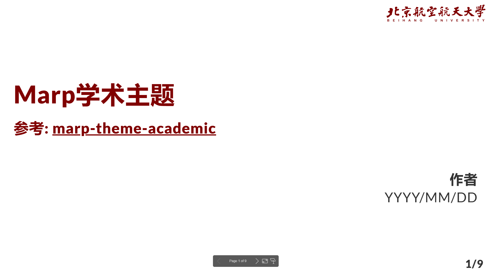

# BUAA-Marp-Theme

based on: https://github.com/kaisugi/marp-theme-academic

feature: 

- BUAA logo (red / blue)
- optimize font
- table adjust

## Usage

export to pdf: 

```shell
npx @marp-team/marp-cli@latest demo_blue.md -o output.pdf --theme ./theme/buaa_blue.css --pdf-outlines --allow-local-files
```

export to pptx: 
```shell
npx @marp-team/marp-cli@latest demo_blue.md -o output.pptx --theme ./theme/buaa_blue.css --pdf-outlines --allow-local-files
```

export to html: 

```shell
npx @marp-team/marp-cli@latest demo_red.md -o demo_red.html --theme ./theme/buaa_red.css --pdf-outlines --allow-local-files
```

for more cli, see: https://github.com/marp-team/marp-cli

## Example




